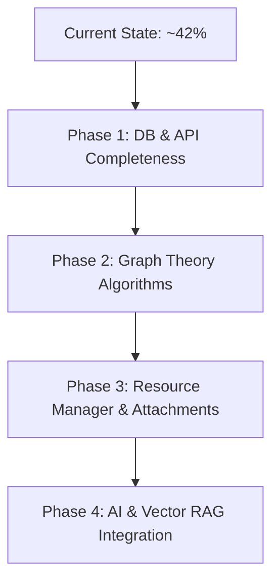

# OneTree - Project Completion & Implementation Status Report

> **Date:** August 12, 2026  
> **Repository:** `d:\nah\one_tree`  
> **Scope Baseline:** [`whole_scope.md`](file:///d:/nah/one_tree/whole_scope.md)

---

## 📊 Executive Overview

| Domain / Layer | Scope Coverage | Status | Summary |
| :--- | :---: | :---: | :--- |
| **1. Full-Stack Foundations & Auth** | **85%** | 🟢 Mostly Complete | Next.js 16 frontend, Express.js backend, Clerk authentication, PostgreSQL + Prisma setup. |
| **2. Interactive Graph UI** | **75%** | 🟢 Functional | React Flow canvas with custom nodes/branches, drag-and-drop, zoom/pan, edge linking, color customization. |
| **3. Database & Schema Persistence** | **60%** | 🟡 Partial | User, Branch, Node, Edge models active with REST APIs. *Missing: Project container model, Resource/Tag endpoints.* |
| **4. Graph Theory & Algorithms** | **25%** | 🟡 Basic | Graph structure defined. *Missing: Cycle detection, dependency locking, topological sorting, path discovery.* |
| **5. Knowledge Organization** | **30%** | 🟡 Basic | Node title, description, markdown workspace, completion toggle. *Missing: File/link attachment manager, tag system.* |
| **6. AI, RAG & Semantic Graph** | **0%** | 🔴 Pending | AI Roadmap Generator, Node-Level RAG, Vector Embeddings, Semantic Recommendations not yet implemented. |

**Overall Project Progress: ~42% Complete**

---

## 🏗️ Detailed Domain & Feature Breakdown

### 1. Full-Stack Infrastructure & Authentication
- **Status:** 🟢 **85% Completed**
- **Implemented:**
  - **Frontend:** Next.js 16 (App Router) + React 19 + TailwindCSS v4 with theme toggle (Dark/Light mode).
  - **Backend:** Express.js 5 REST server (`one_tree_be`) with structured router, middleware, and controllers.
  - **Authentication:** Clerk integration on both frontend (`@clerk/nextjs`) and backend (`@clerk/backend`). Protected API routes via `requireAuth` middleware and `/users/sync` endpoint.
  - **Database ORM:** Prisma ORM connected to PostgreSQL database.
- **Pending:**
  - Deployment configuration (Vercel setup scripts, cloud DB connection strings).
  - Production error logging and health monitoring.

---

### 2. Interactive Graph Canvas (Visual Interface)
- **Status:** 🟢 **75% Completed**
- **Implemented:**
  - Interactive graph workspace powered by `@xyflow/react` (React Flow 12).
  - Drag-and-drop repositioning for branches and nodes.
  - Smooth pan, zoom, and minimap navigation controls.
  - Custom node components (`branchHeader`, `stepNode`) with customizable color palettes.
  - Edge connection between nodes with directional arrows and completion state animations.
  - Real-time graph position update endpoint (`/nodes/positions`) and batch graph persistence (`/save-graph`).
- **Pending:**
  - Cross-branch edge connection UI drawer / modal workflow.
  - Graph auto-layout / auto-alignment algorithms (Dagre/Klay integration).

---

### 3. Database Systems & Data Modeling
- **Status:** 🟡 **60% Completed**
- **Implemented Schema (`schema.prisma`):**
  - `User`: Managed via Clerk ID (`clerkId`, `id`).
  - `Branch`: Topic/domain grouping with user relation, position, color, objective.
  - `Node`: Learning step with branch relation, order, title, description, content, completion timestamp, canvas coordinates.
  - `Edge`: Directed relationships between nodes with `EdgeType` (`PROGRESSION`, `RELATED`, `DEPENDENCY`).
  - `Resource` & `Tag` / `NodeTag`: Schema tables defined in Prisma.
- **Pending / Gaps:**
  - **Project Container Model:** Scope mentions multi-project management (`User -> Projects -> Branches`). Schema currently attaches `Branch` directly to `User`.
  - **Resource & Tag APIs:** `Resource` and `Tag` models exist in Prisma schema but lack controllers, express routes (`/resources`, `/tags`), and frontend interfaces.
  - **Notes Entity:** Currently stored as single `content` string inside `Node` rather than dedicated table.

---

### 4. Graph Theory & Dependency Operations
- **Status:** 🟡 **25% Completed**
- **Implemented:**
  - Directed graph representation (`Node` source -> target `Edge`).
  - Edge classifications: `PROGRESSION`, `RELATED`, `DEPENDENCY`.
- **Pending:**
  - **Cycle Detection Algorithm:** Preventing circular dependencies (e.g. A -> B -> C -> A) during edge creation and save operations.
  - **Prerequisite Locking:** Graph traversal logic to lock target nodes until prerequisite incoming `DEPENDENCY` nodes are marked complete.
  - **Topological Sorting & Path Discovery:** Calculating optimal learning sequences and shortest learning paths across knowledge branches.

---

### 5. Knowledge Organization & Resource Attachment
- **Status:** 🟡 **30% Completed**
- **Implemented:**
  - Node workspace drawer with title, description, and Markdown note editor.
  - Individual node completion toggling and branch overall completion percentage calculation.
- **Pending:**
  - **Resource Manager:** Ability to attach links, PDFs, YouTube videos, and documentation files to specific nodes.
  - **Tagging System:** Categorizing concepts with searchable multi-tags across branches.

---

### 6. Information Retrieval & AI Features (Future Roadmap)
- **Status:** 🔴 **0% Completed**
- **Pending Features:**
  - **AI Roadmap Generator:** LLM integration (OpenAI / Gemini) to auto-generate graph branches, nodes, and prerequisites from a text prompt (e.g., *"Become a DevOps Engineer"*).
  - **Vector Embeddings Pipeline:** Chunking & embedding node resources into vector databases (pgvector / Pinecone).
  - **Node-Level RAG Assistant:** Contextual AI chat limited strictly to resources attached to a specific node.
  - **Semantic Recommendations:** Cosine similarity calculation between node embeddings to suggest related concepts and missing prerequisite connections automatically.

---

## 🎯 Next Steps & Recommended Action Plan

1. **Phase 1 (Database & API Completeness):**
   - Add `Project` model in Prisma (`User -> Project -> Branch`).
   - Create Express routes & controllers for `Resource` attachment CRUD and `Tag` filtering.
2. **Phase 2 (Graph Theory Engine):**
   - Implement backend cycle detection helper using DFS/Kahn's algorithm before saving edges.
   - Enforce dependency resolution rules (prerequisite node completion locks).
3. **Phase 3 (Resource & Knowledge Management UI):**
   - Add resource modal to `GraphEditorPage` for adding URLs, PDFs, and video links.
4. **Phase 4 (AI & RAG Features):**
   - Integrate AI SDK (Gemini/OpenAI API) for auto-roadmap generation.
   - Setup pgvector / vector embeddings pipeline for node-level RAG.

---

*Report generated automatically by analyzing source code in `one_tree_be` and `one_tree_ui` against [`whole_scope.md`](file:///d:/nah/one_tree/whole_scope.md).*
